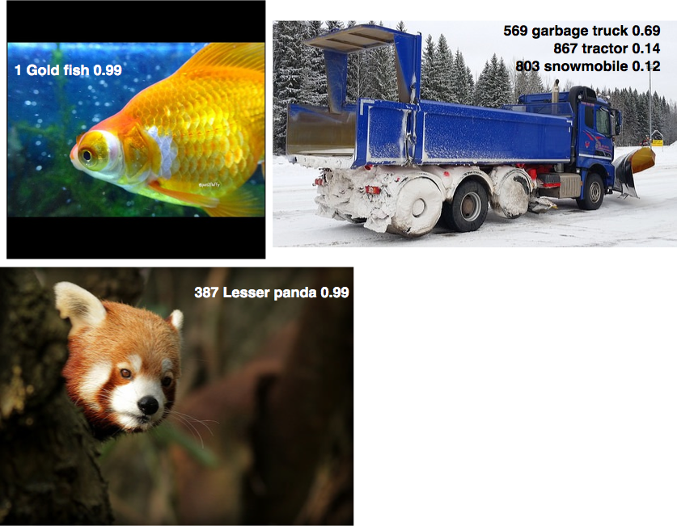
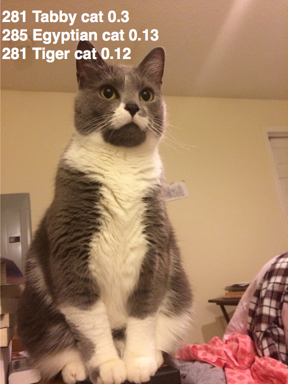
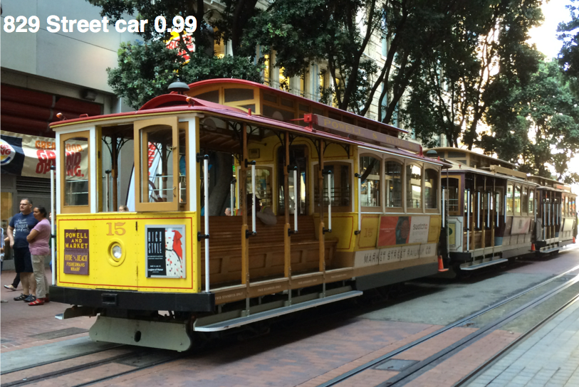

# VGG19-FCN for Image Classification
 - TensorFlow implementation of [Very Deep Convolutional Networks for Large-Scale Image Recognition](https://arxiv.org/abs/1409.1556). 
 
 - The VGG19 model is defined in *VGG.py*.

 
## Requirements
- Python 3.3+
- [Tensorflow 1.0+](https://www.tensorflow.org/)
- [TensorCV](https://github.com/conan7882/DeepVision-tensorflow)

<!--## TODO

- [x] Test pre-trained model
- [ ] Fine tuning-->


## Implementation Details

For testing the pre-trained model

- The last three fully connected layers are converted to convolutional layers making it a fully convolutional network. Then the input images can be arbitrary size.

- Images are rescaled so that the smallest side equals 224 before fed into the model.

- [Global average pooling](https://arxiv.org/abs/1312.4400) is used to get fix size of class scores for all the test images.

## Results
- ### Image classification on ImageNet


- ### Images from my photo collection
<div align='left'>
  
  
</div>


## Usage
### Download pre-trained VGG19 model
Download the pre-trained parameters VGG19 NPY [here](https://github.com/machrisaa/tensorflow-vgg#tensorflow-vgg16-and-vgg19).
### Config path
All directories are setup in *config.py*.

- Put the pre-trained paramenters in *`config.model_dir`*.
- Put testing images in *`config.valid_data_dir`*.

### ImageNet Classification
- Put test image in folder *`config.valid_data_dir`*, then run the script:

```
python VGG_FCN_pre_trained.py
```
       
   The output are the top-5 class labels and probabilities, and the top-1 human label.
   
## Author
Qian Ge
